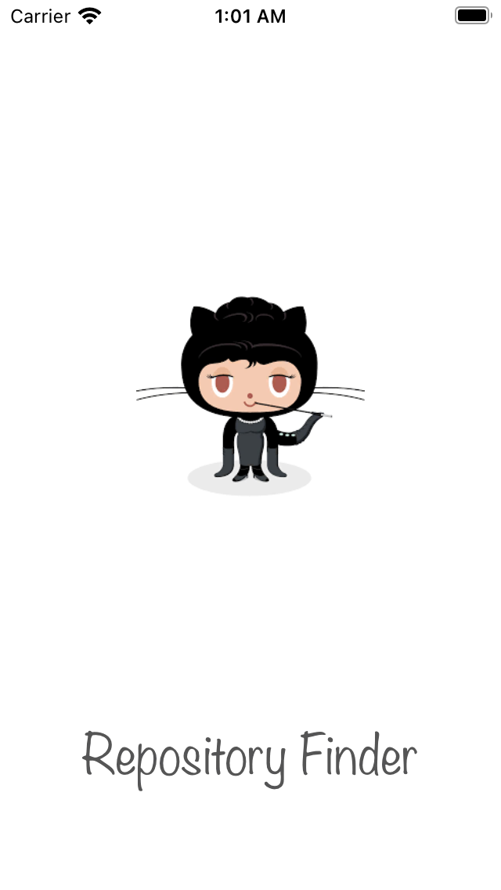

# Repository Finder
## Build & Running 
To build the project:
1. Oper Terminal
2. Go to the proyect folder
1. Run pod install
2. Open the `.xcodeproj` file
2. Run the application (`CMD + R`) on your chosen simluator 

## Methodology & Reasoning
During the process a number of decisions were made, see below the choices that were made and the reasons why 

### Design Patterns
* The application follows the Model View ViewModel pattern at its core. 

### Networking
* `Decodable` protocol was used to parsing the `JSON` response due to its ease of use
 
 
 
 

